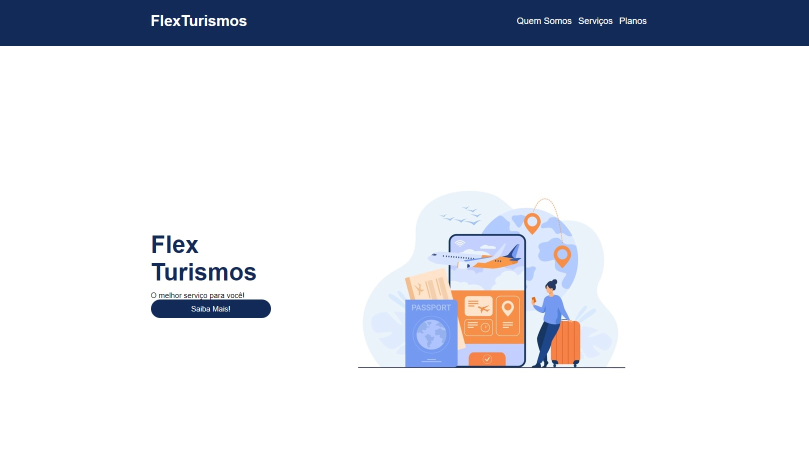
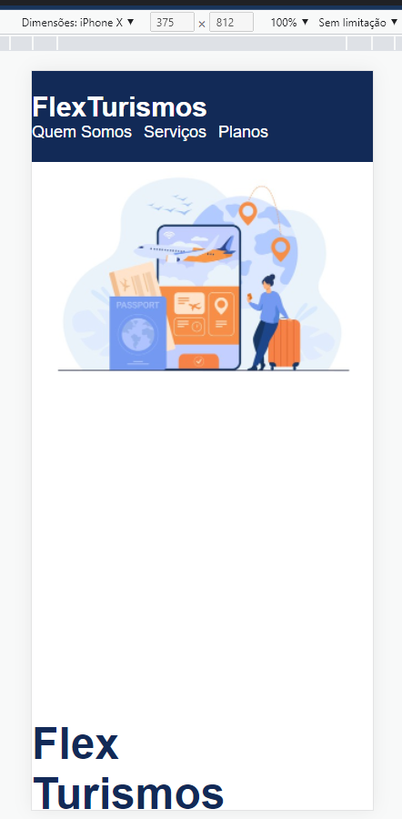
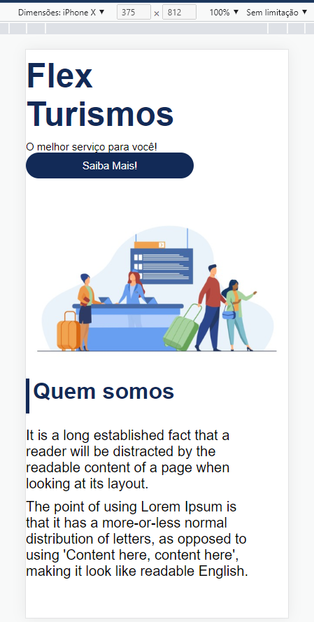
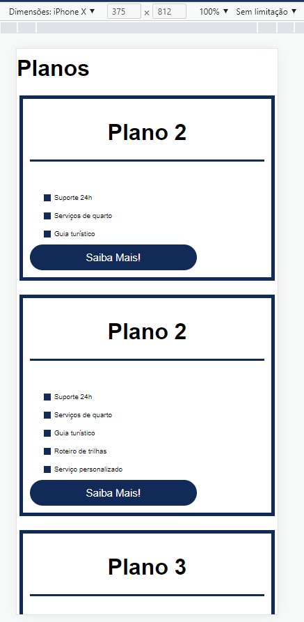
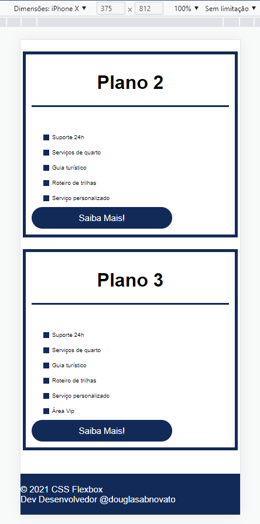
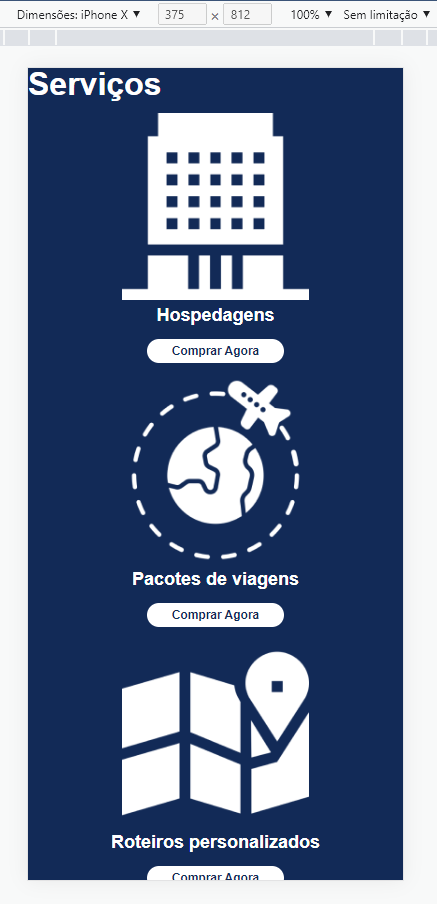
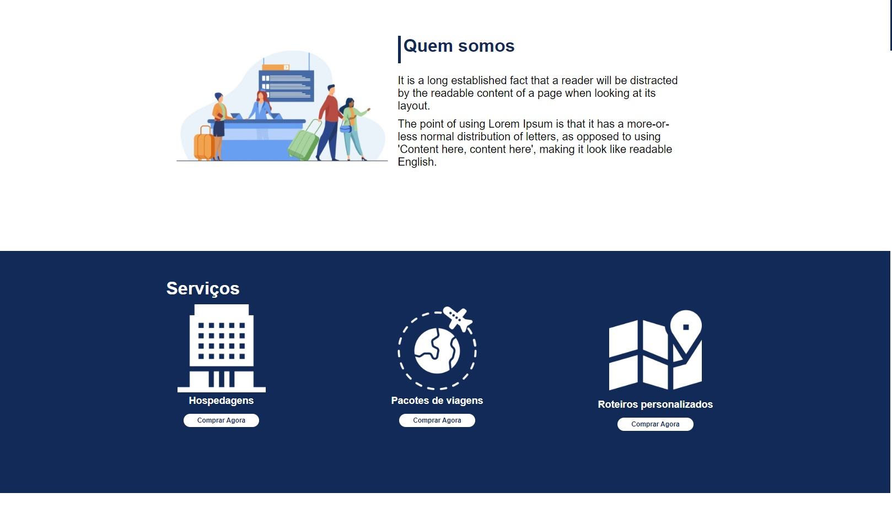
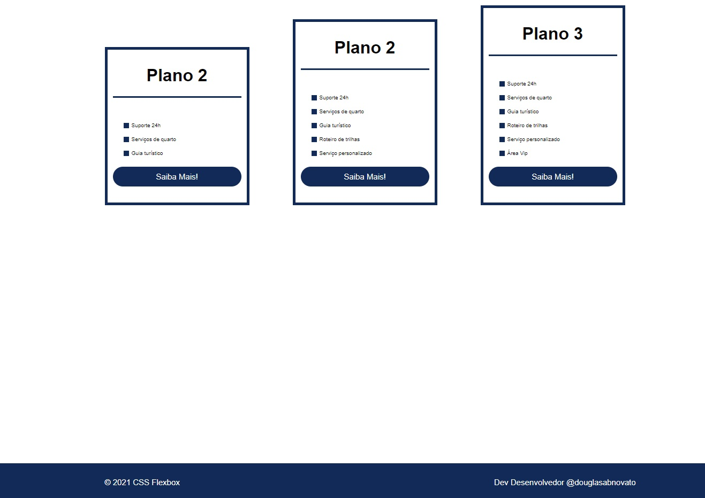

<h3 align="center"> 
	🚧 Flex Turismos 🚀
</h3> 

<h1 align="center">
    
</h1>

#### 💻 Sobre o projeto

---

- Desenvolver um site para divulgar a agência de turismos com html, css e javascript.
- Seguir o paradigma mobile first para desenvolver o layout.

#### 🚀 Techs

---

- HTML
- CSS
- JavaScript

#### Versão 2 - Flex Turismos Mobile

- ajustado alguns detalhes na media query na dimensão 992px
- Construindo a aplicação em versões.

<p align="center" style="display: flex; align-items: flex-start; justify-content: center;">  
   
   
  
  
  
</p>

#### Versão 1 - Flex Turismos

- [ ] flexbox projeto 
- estrutura html e os assets
- unidade de medida flexíveis
- em: leva em consideração o setado do pai
- rem: font-size base de 16px
- rem: base de cálculo das medidas 10px - 0.625rem; 12px - 0.75rem; 14px - 0.875rem; 16px - 1rem; 18px - 1.125rem
- estratégia para facilitar os cálculos:
````css
html{ font-size: 62.5%; } 
h1{ font-size: 1.2rem; }
````
- Construindo a aplicação em versões.
<p align="center" style="display: flex; align-items: flex-start; justify-content: center;">  
   
   
  
</p>

#### 😯 Finalizado 

---  

- Construindo a aplicação em versões.

<p align="center" style="display: flex; align-items: flex-start; justify-content: center;">  
  
</p>

#### 🧭 Adicionado

---  

- Hospedado no Github Pages em Versões

#### 💻 Próximo passo

---  

- [ ] Adicionar novas seções, como a de depoimentos.
- [ ] Adaptar lógica para a fluídez das funcionalidades.
- [ ] responsividade
- [ ] acessibilidade
- [ ] modo dark / light
- [ ] interatividade, crud, json
- [ ] favicon

---  

Feito com ❤️ por Douglas A B Novato 👋🏽 [Entre em contato!](https://www.linkedin.com/in/douglasabnovato/)
